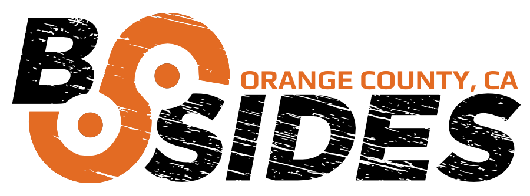

bSidesOC Logo
-------------

This is the Logo repository for [bSidesOC](http://bsidesoc.org).

Our Stylized Bootstrap Logo, and info.
https://bsidesoc.org/community/about/logo/

Image: 
https://bsidesoc.org/community/about/logo/logo-bsidesoc/

Within this repo are several files.
[logo-test.html](logo-test.html)

Please use the [logo-test.html](logo-test.html) as examples for transparency usage with the logo images. Unfortunately, with the background color changes needed this cannot be markdown to my knowledge, which would allow for viewing on Github.

Working Logo Source image the .svg file which is edited with Inkscape.

It is an imported .eps file which was given to us by the main bSides California.

[bSidesOC_Logo_Orange_Black.eps](bSidesOC_Logo_Orange_Black.eps)

QR & Tracking
----------------

